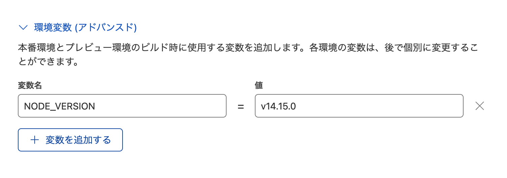

こんにちは、fluoriteのfです。

初めてGatsbyを使ったブログをCloudflare Pagesで公開する際にビルドエラーが出た件について改めて記事を作成しておきます。


## ■ エラー内容

```
2022-05-07T23:34:00.900466Z	 ERROR
2022-05-07T23:34:00.90063Z	
2022-05-07T23:34:00.900767Z	Gatsby requires Node.js 14.15.0 or higher (you have v12.18.0).
2022-05-07T23:34:00.900889Z	Upgrade Node to the latest stable release: https://gatsby.dev/upgrading-node-js
```

明らかに v14.15.0 以上を使えとありますね。

## ■ 対策

ビルド時の環境 NODE_VERSION を追加します。



これでビルドが成功するようになります。

## ■ どうして?

Gatsby v4のリリースノートに記載がありました。v4を使う場合だけVersionを調整すれば良さそうですね。

```
Node 14

We are dropping support for Node 12 as a new underlying dependency (lmdb-store) is requiring >=14.15.0. See the main changes in Node 14 release notes.

Check Node’s releases document for version statuses.
```

[v4.0リリースノート](https://www.gatsbyjs.com/docs/reference/release-notes/v4.0/#node-14)


## ■ 単純な理由で安心しましたね

Cloudflare Pages は 指定したブランチにpushすればビルドが実行されるのでとても便利ですね。Github Actions を使って同様のことができるとはいえ、ビルド方法がプリセットされているのでポチポチと設定するだけで良いというのは取っ付き易いと感じました。

今後も継続していきます。あとGatsbyに機能追加なども検討したいですね。
それでは!!

## ■ 参考リンク

- [Deploy a Gatsby site](https://developers.cloudflare.com/pages/framework-guides/deploy-a-gatsby-site)
- [Jamstackホスティング決定版? Cloudflare Pagesを試してみたよ！](https://dev.classmethod.jp/articles/cloudflare-pages/)
- [Cloudflare PagesでNode.jsのバージョンを指定する](https://dev.classmethod.jp/articles/cloudflare-pages-node-version/)
- [Netlify says, "error Gatsby requires Node.js 14.15.0 or higher (you have v12.18.0)"—yet I have the newest Node version?](https://stackoverflow.com/questions/70362755/netlify-says-error-gatsby-requires-node-js-14-15-0-or-higher-you-have-v12-18)