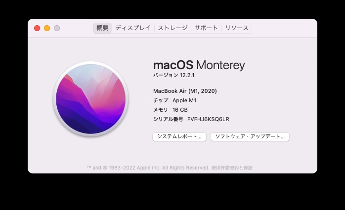

謎の現象が発生して困った fです。こんにちは。
結論から言うと原因不明なので、ホームディレクトリ以下に tmp ディレクトリを作成して回避しております。

たぶん OSのファイルシステムの特性と関係していると推測しています。/tmp は /private/tmp と表示されることもあるためです。

エラー内容はWORK DIR内にterraform のプロセスが .tf ファイルを見つけることができないというもの。

ボリュームマウントされているはずなのですけどね。

原因の特定ができればここで紹介したいと思います。
試しに ls してみたら、文字化けしたファイルのようなものが一つだけ存在していました。謎ですね。