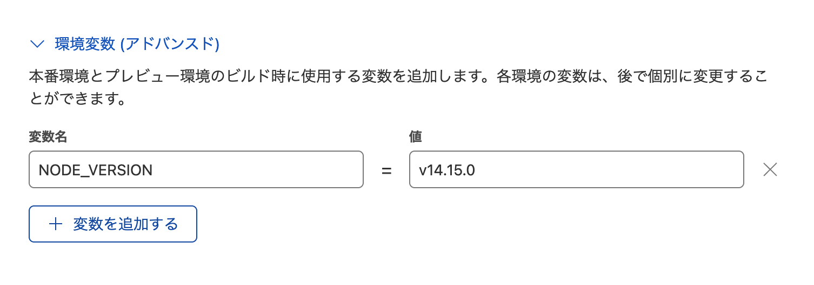

こんにちは、fluoriteのfです。

弊社のBlogを開設するにあたり、GatsbyというCMSフレームワークを使うことにしました。

CloudFlareを使ってみたいと思って調べていたらGatsbyに出会ったという流れでして。新し物好きの血が騒ぎましたね。

## ■ やったこと

- Google Domainsでドメインを取得する
  - 取得済みのドメインがあったのでそれを使っています
- CloudFlareのアカウントを作成して Google Domains でカスタムDNSの設定をする
  - WhoisのDNSレコードを変更することに相当しますね。簡単にできるGoogle DomainsのUIがうれしかったです
- 開発マシン上にGatsbyをインストール
  - 初回は素直に直接インストールすることにしました
- ブログ上に表示されるプロフィールの調整
  - 緩い感じでいきたいですね
- このPostの作成
  - VS Codeで買いています
- Githubにリポジトリ作成 + CloudFlareに設定追加
  - 作成先は秘密ですよ

## ■ ひさしぶりのNPM

4年ほどまえになりますかね、nodejsを使ってフロントエンド開発をしていたころ以来のnpmコマンドでした。

個人的にはdockerにフレームワークとnodejsをまとめてしまいたいなと考えていて、おいおい作業していきたいです。

## ■ CMSフレームワーク

Markdownでブログが書ける仕組みは昔からあるんですが、最新のCMSフレームワークで作成しているというのはやはり気持のノリが違いますね。

これからどれだけ続けることができるのか、息が切れずに継続できるよう頑張っていきたいと思います。

## ■ ビルドエラー

公式の手順どおり実行してもエラーって発生するものですね。

```
2022-05-07T23:33:04.294898Z	Cloning repository...
2022-05-07T23:33:05.31716Z	Success: Finished cloning repository files
2022-05-07T23:33:05.949494Z	Installing dependencies
2022-05-07T23:33:05.961875Z	Python version set to 2.7
2022-05-07T23:33:09.818321Z	v12.18.0 is already installed.
2022-05-07T23:33:11.190672Z	Now using node v12.18.0 (npm v6.14.4)
2022-05-07T23:33:11.528483Z	Started restoring cached build plugins
2022-05-07T23:33:11.545031Z	Finished restoring cached build plugins
2022-05-07T23:33:12.246741Z	Attempting ruby version 2.7.1, read from environment
2022-05-07T23:33:18.189658Z	Using ruby version 2.7.1
2022-05-07T23:33:18.558162Z	Using PHP version 5.6
2022-05-07T23:33:18.729007Z	5.2 is already installed.
2022-05-07T23:33:18.757746Z	Using Swift version 5.2
2022-05-07T23:33:18.758999Z	Started restoring cached node modules
2022-05-07T23:33:18.779678Z	Finished restoring cached node modules
2022-05-07T23:33:19.020729Z	Installing NPM modules using NPM version 6.14.4
2022-05-07T23:33:19.979628Z	npm WARN read-shrinkwrap This version of npm is compatible with lockfileVersion@1, but package-lock.json was generated for lockfileVersion@2. I'll try to do my best with it!
2022-05-07T23:33:50.967325Z	
2022-05-07T23:33:50.967869Z	> msgpackr-extract@1.1.4 install /opt/buildhome/repo/node_modules/msgpackr-extract
2022-05-07T23:33:50.968047Z	> node-gyp-build-optional-packages
2022-05-07T23:33:50.968198Z	
2022-05-07T23:33:51.180826Z	
2022-05-07T23:33:51.181145Z	> @parcel/watcher@2.0.5 install /opt/buildhome/repo/node_modules/@parcel/watcher
2022-05-07T23:33:51.181369Z	> node-gyp-build
2022-05-07T23:33:51.181619Z	
2022-05-07T23:33:51.656696Z	
2022-05-07T23:33:51.657028Z	> lmdb@2.2.4 install /opt/buildhome/repo/node_modules/@parcel/cache/node_modules/lmdb
2022-05-07T23:33:51.657214Z	> node-gyp-build
2022-05-07T23:33:51.657358Z	
2022-05-07T23:33:51.855657Z	
2022-05-07T23:33:51.855991Z	> lmdb@2.2.6 install /opt/buildhome/repo/node_modules/lmdb
2022-05-07T23:33:51.856149Z	> node-gyp-build
2022-05-07T23:33:51.856279Z	
2022-05-07T23:33:52.11989Z	
2022-05-07T23:33:52.120262Z	> sharp@0.30.4 install /opt/buildhome/repo/node_modules/sharp
2022-05-07T23:33:52.120462Z	> (node install/libvips && node install/dll-copy && prebuild-install) || (node install/can-compile && node-gyp rebuild && node install/dll-copy)
2022-05-07T23:33:52.120678Z	
2022-05-07T23:33:52.445994Z	sharp: Downloading https://github.com/lovell/sharp-libvips/releases/download/v8.12.2/libvips-8.12.2-linux-x64.tar.br
2022-05-07T23:33:53.116051Z	sharp: Integrity check passed for linux-x64
2022-05-07T23:33:53.934292Z	
2022-05-07T23:33:53.934621Z	> core-js@2.6.12 postinstall /opt/buildhome/repo/node_modules/babel-runtime/node_modules/core-js
2022-05-07T23:33:53.934793Z	> node -e "try{require('./postinstall')}catch(e){}"
2022-05-07T23:33:53.93499Z	
2022-05-07T23:33:54.027733Z	Thank you for using core-js ( https://github.com/zloirock/core-js ) for polyfilling JavaScript standard library!
2022-05-07T23:33:54.028019Z	
2022-05-07T23:33:54.028171Z	The project needs your help! Please consider supporting of core-js on Open Collective or Patreon: 
2022-05-07T23:33:54.02839Z	> https://opencollective.com/core-js 
2022-05-07T23:33:54.028533Z	> https://www.patreon.com/zloirock 
2022-05-07T23:33:54.028642Z	
2022-05-07T23:33:54.028787Z	Also, the author of core-js ( https://github.com/zloirock ) is looking for a good job -)
2022-05-07T23:33:54.028912Z	
2022-05-07T23:33:54.074972Z	
2022-05-07T23:33:54.075269Z	> core-js@3.22.4 postinstall /opt/buildhome/repo/node_modules/core-js
2022-05-07T23:33:54.075426Z	> node -e "try{require('./postinstall')}catch(e){}"
2022-05-07T23:33:54.075568Z	
2022-05-07T23:33:54.161705Z	Thank you for using core-js ( https://github.com/zloirock/core-js ) for polyfilling JavaScript standard library!
2022-05-07T23:33:54.161987Z	
2022-05-07T23:33:54.162126Z	The project needs your help! Please consider supporting of core-js:
2022-05-07T23:33:54.162263Z	> https://opencollective.com/core-js 
2022-05-07T23:33:54.162384Z	> https://patreon.com/zloirock 
2022-05-07T23:33:54.16251Z	> bitcoin: bc1qlea7544qtsmj2rayg0lthvza9fau63ux0fstcz 
2022-05-07T23:33:54.162627Z	
2022-05-07T23:33:54.162742Z	Also, the author of core-js ( https://github.com/zloirock ) is looking for a good job -)
2022-05-07T23:33:54.162858Z	
2022-05-07T23:33:54.172228Z	
2022-05-07T23:33:54.172491Z	> core-js-pure@3.22.4 postinstall /opt/buildhome/repo/node_modules/core-js-pure
2022-05-07T23:33:54.172657Z	> node -e "try{require('./postinstall')}catch(e){}"
2022-05-07T23:33:54.172779Z	
2022-05-07T23:33:54.649078Z	
2022-05-07T23:33:54.649407Z	> es5-ext@0.10.61 postinstall /opt/buildhome/repo/node_modules/es5-ext
2022-05-07T23:33:54.649573Z	>  node -e "try{require('./_postinstall')}catch(e){}" || exit 0
2022-05-07T23:33:54.649703Z	
2022-05-07T23:33:54.834969Z	
2022-05-07T23:33:54.835323Z	> gatsby-telemetry@3.13.0 postinstall /opt/buildhome/repo/node_modules/gatsby-telemetry
2022-05-07T23:33:54.83549Z	> node src/postinstall.js || true
2022-05-07T23:33:54.835608Z	
2022-05-07T23:33:54.958877Z	
2022-05-07T23:33:54.959226Z	> gatsby-cli@4.13.0 postinstall /opt/buildhome/repo/node_modules/gatsby/node_modules/gatsby-cli
2022-05-07T23:33:54.959439Z	> node scripts/postinstall.js
2022-05-07T23:33:54.959569Z	
2022-05-07T23:33:55.063515Z	
2022-05-07T23:33:55.06383Z	> gatsby@4.13.1 postinstall /opt/buildhome/repo/node_modules/gatsby
2022-05-07T23:33:55.064006Z	> node scripts/postinstall.js
2022-05-07T23:33:55.064138Z	
2022-05-07T23:33:56.81341Z	npm WARN optional SKIPPING OPTIONAL DEPENDENCY: msgpackr-extract-win32-x64@1.1.0 (node_modules/msgpackr-extract-win32-x64):
2022-05-07T23:33:56.813704Z	npm WARN notsup SKIPPING OPTIONAL DEPENDENCY: Unsupported platform for msgpackr-extract-win32-x64@1.1.0: wanted {"os":"win32","arch":"x64"} (current: {"os":"linux","arch":"x64"})
2022-05-07T23:33:56.813859Z	npm WARN optional SKIPPING OPTIONAL DEPENDENCY: msgpackr-extract-linux-arm64@1.1.0 (node_modules/msgpackr-extract-linux-arm64):
2022-05-07T23:33:56.814005Z	npm WARN notsup SKIPPING OPTIONAL DEPENDENCY: Unsupported platform for msgpackr-extract-linux-arm64@1.1.0: wanted {"os":"linux","arch":"arm64"} (current: {"os":"linux","arch":"x64"})
2022-05-07T23:33:56.81414Z	npm WARN optional SKIPPING OPTIONAL DEPENDENCY: msgpackr-extract-linux-arm@1.1.0 (node_modules/msgpackr-extract-linux-arm):
2022-05-07T23:33:56.814288Z	npm WARN notsup SKIPPING OPTIONAL DEPENDENCY: Unsupported platform for msgpackr-extract-linux-arm@1.1.0: wanted {"os":"linux","arch":"arm"} (current: {"os":"linux","arch":"x64"})
2022-05-07T23:33:56.814427Z	npm WARN optional SKIPPING OPTIONAL DEPENDENCY: msgpackr-extract-darwin-x64@1.1.0 (node_modules/msgpackr-extract-darwin-x64):
2022-05-07T23:33:56.814545Z	npm WARN notsup SKIPPING OPTIONAL DEPENDENCY: Unsupported platform for msgpackr-extract-darwin-x64@1.1.0: wanted {"os":"darwin","arch":"x64"} (current: {"os":"linux","arch":"x64"})
2022-05-07T23:33:56.814659Z	npm WARN optional SKIPPING OPTIONAL DEPENDENCY: msgpackr-extract-darwin-arm64@1.1.0 (node_modules/msgpackr-extract-darwin-arm64):
2022-05-07T23:33:56.814771Z	npm WARN notsup SKIPPING OPTIONAL DEPENDENCY: Unsupported platform for msgpackr-extract-darwin-arm64@1.1.0: wanted {"os":"darwin","arch":"arm64"} (current: {"os":"linux","arch":"x64"})
2022-05-07T23:33:56.814884Z	npm WARN optional SKIPPING OPTIONAL DEPENDENCY: fsevents@2.3.2 (node_modules/fsevents):
2022-05-07T23:33:56.815002Z	npm WARN notsup SKIPPING OPTIONAL DEPENDENCY: Unsupported platform for fsevents@2.3.2: wanted {"os":"darwin","arch":"any"} (current: {"os":"linux","arch":"x64"})
2022-05-07T23:33:56.815114Z	
2022-05-07T23:33:56.821935Z	added 1807 packages from 1063 contributors and audited 1813 packages in 36.893s
2022-05-07T23:33:58.086373Z	
2022-05-07T23:33:58.087034Z	306 packages are looking for funding
2022-05-07T23:33:58.08753Z	  run `npm fund` for details
2022-05-07T23:33:58.087809Z	
2022-05-07T23:33:58.088072Z	found 13 vulnerabilities (8 moderate, 4 high, 1 critical)
2022-05-07T23:33:58.088333Z	  run `npm audit fix` to fix them, or `npm audit` for details
2022-05-07T23:33:58.116917Z	NPM modules installed
2022-05-07T23:33:58.489043Z	Installing Hugo 0.54.0
2022-05-07T23:33:59.196361Z	Hugo Static Site Generator v0.54.0-B1A82C61A/extended linux/amd64 BuildDate: 2019-02-01T10:04:38Z
2022-05-07T23:33:59.200876Z	Started restoring cached go cache
2022-05-07T23:33:59.225542Z	Finished restoring cached go cache
2022-05-07T23:33:59.393792Z	go version go1.14.4 linux/amd64
2022-05-07T23:33:59.415779Z	go version go1.14.4 linux/amd64
2022-05-07T23:33:59.420355Z	Installing missing commands
2022-05-07T23:33:59.420608Z	Verify run directory
2022-05-07T23:33:59.420762Z	Executing user command: gatsby build
2022-05-07T23:33:59.888155Z	tput: unknown terminal "unknown"
2022-05-07T23:33:59.889911Z	╔════════════════════════════════════════════════════════════════════════╗
2022-05-07T23:33:59.890193Z	║                                                                        ║
2022-05-07T23:33:59.890407Z	║   Gatsby collects anonymous usage analytics                            ║
2022-05-07T23:33:59.890572Z	║   to help improve Gatsby for all users.                                ║
2022-05-07T23:33:59.890713Z	║                                                                        ║
2022-05-07T23:33:59.890932Z	║   If you'd like to opt-out, you can use `gatsby telemetry --disable`   ║
2022-05-07T23:33:59.891054Z	║   To learn more, checkout https://gatsby.dev/telemetry                 ║
2022-05-07T23:33:59.891164Z	║                                                                        ║
2022-05-07T23:33:59.891338Z	╚════════════════════════════════════════════════════════════════════════╝
2022-05-07T23:34:00.900097Z	
2022-05-07T23:34:00.900466Z	 ERROR
2022-05-07T23:34:00.90063Z	
2022-05-07T23:34:00.900767Z	Gatsby requires Node.js 14.15.0 or higher (you have v12.18.0).
2022-05-07T23:34:00.900889Z	Upgrade Node to the latest stable release: https://gatsby.dev/upgrading-node-js
2022-05-07T23:34:00.901007Z	
2022-05-07T23:34:00.901142Z	
2022-05-07T23:34:01.023971Z	Failed: build command exited with code: 1
```

Gatsbyの公式ドキュメントにも nodejs のバージョンは 12系でとあるのでCloudFlareはそれに準拠しているんでしょう。

```
brew install node@12
```
[using homebrew](https://www.gatsbyjs.com/docs/upgrading-node-js/#using-homebrew)


今回はCloudFlareのnodejsのバージョンを変更する方法でビルドしなおしてみます。
DevelopersIOの優良な解説記事にはいつもお世話になっています。

[Cloudflare PagesでNode.jsのバージョンを指定する](https://dev.classmethod.jp/articles/cloudflare-pages-node-version/)

以下のように設定してみます。



ビルド成功しました!!


## ■ 初回から苦労しましたね(^^;)

今後ともよろしくお願いいたします。
